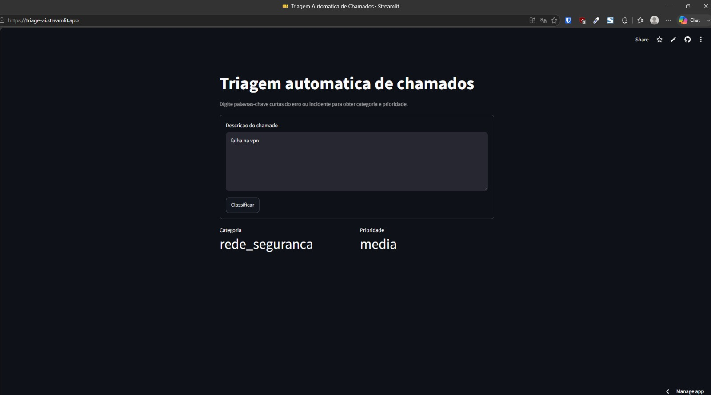

# IT Support Ticket Triage

## Summary
This repository implements a prototype for automatic triage of information technology support tickets in Brazilian Portuguese, with a focus on simultaneously classifying category and priority from free-text descriptions. The final solution combines `Scikit-Learn` for model training and persistence with `Streamlit` for the interactive inference interface.

## 1. Overview
The project flow is organized into two main stages:

1. `train.py` creates a synthetic set of pt-BR examples, fits a supervised pipeline, and saves the `pipeline_itsm.joblib` artifact.
2. `app.py` loads the saved pipeline with `joblib`, exposes the interface through `Streamlit`, and performs real-time inference.

When the model file is not present in the root directory, the application uses a local demo routine only to keep the interface usable. Under normal execution conditions, prediction should be performed exclusively by the trained artifact.

## 2. Final Architecture
The final solution follows this processing chain:

- ticket text input;
- vectorization with unigram-based `TfidfVectorizer`;
- manual removal of Portuguese stop words;
- multi-label classification with `MultiOutputClassifier(RandomForestClassifier)`;
- pipeline persistence with `joblib.dump`;
- on-demand loading in `Streamlit` with `@st.cache_resource`;
- display of category and priority results through `metric` components.

In practical terms, the model receives only the incident description as input. The output labels are kept in separate columns to avoid information leakage and preserve the separation between features and target.

## 3. File Structure
```text
.
├── app.py
├── train.py
├── pipeline_itsm.joblib
├── README.md
└── .gitignore
```

Note: the `pipeline_itsm.joblib` file is the trained artifact consumed by the application. The `.gitignore` file is configured to isolate virtual environments, caches, temporary dependencies, and raw data directories.

## 4. Methodology
### 4.1 Synthetic Dataset
Training uses a synthetic Brazilian Portuguese dataset containing typical support ticket descriptions, with output pairs for `categoria` and `prioridade`. The goal is to demonstrate a reproducible inference pipeline, not to replace real institutional datasets.

### 4.2 Text Representation
Descriptions are transformed by `TfidfVectorizer` with:

- lowercase normalization;
- accent removal;
- unigrams only;
- a manual list of Portuguese stop words focused on connectives and low-information functional terms.

This choice favors short technical keywords and reduces dependence on full sentences, which tends to increase robustness against wording variation and reduce bias introduced by connectives or generic phrasing.

### 4.3 Supervised Model
The classifier used is `MultiOutputClassifier` wrapping `RandomForestClassifier`. This combination makes it possible to predict more than one target from the same input text without requiring separate external architectures for each label.

### 4.4 Persistence and Inference
After fitting, the pipeline is saved to disk with `joblib`. The Streamlit application reuses the same artifact, avoiding divergence between training and usage. Loading is memoized with `@st.cache_resource` to reduce startup cost.

## 5. Data Leakage Control
The training code was structured to minimize data leakage:

- only the textual `texto` field is used as model input;
- `categoria` and `prioridade` remain separate as targets;
- vectorization is part of the pipeline, which prevents improper reuse of transformations already fitted on data outside the flow;
- the dataset used is synthetic and closed, with no mixture of production test data.

As a methodological limitation, this repository does not implement a formal train/validation/test split or cross-validation. In a complete experimental submission, that step should be added with metrics reported separately.

## 6. Running the Project
### 6.1 Environment
Python 3.11 or newer is recommended, with the following libraries:

- `scikit-learn`
- `streamlit`
- `joblib`
- `numpy`

### 6.2 Training
```bash
python train.py
```

This command generates or updates `pipeline_itsm.joblib` in the root directory.

### 6.3 Web Application
```bash
streamlit run app.py
```

The browser will show a form for entering the ticket description and then return the category and priority predicted by the pipeline.

## 7. Result
When running the system, the result should be as shown below:


Link to view the official PoC deployment via web: https://triage-ai.streamlit.app/

## 8. Limitations
The system was designed as a proof of concept and has relevant limitations:

- the training dataset is synthetic and small;
- generalization to real operational language has not yet been measured;
- there is no explicit probability calibration;
- there is no integration with an ITSM queue, corporate API, or persistent storage;
- the mock fallback exists only for demonstration, not for operational use.

## 9. Reproducibility
For minimum reproducibility:

- run `train.py` to generate the trained artifact;
- keep the same Python and library versions;
- preserve the `pipeline_itsm.joblib` file when you want to reproduce the already fitted inference pipeline;
- record dependency versions in an environment file or `requirements.txt` if the submission requires additional traceability.

## 10. BibTeX References
```bibtex
@misc{scikit-learn,
  author       = {{Scikit-learn developers}},
  title        = {Scikit-learn: Machine Learning in Python},
  year         = {2026},
  howpublished = {\url{https://scikit-learn.org/}},
  note         = {Accessed on Jun 07, 2026}
}

@misc{streamlit,
  author       = {{Streamlit Inc.}},
  title        = {Streamlit: The fastest way to build and share data apps},
  year         = {2026},
  howpublished = {\url{https://streamlit.io/}},
  note         = {Accessed on Jun 07, 2026}
}

@misc{joblib,
  author       = {{joblib developers}},
  title        = {joblib: Python utilities for lightweight pipelining},
  year         = {2026},
  howpublished = {\url{https://joblib.readthedocs.io/}},
  note         = {Accessed on Jun 07, 2026}
}

@misc{python,
  author       = {{Python Software Foundation}},
  title        = {Python Language Reference},
  year         = {2026},
  howpublished = {\url{https://www.python.org/}},
  note         = {Accessed on Jun 07, 2026}
}
```

## 11. Translation Note
The translation into another language should be produced from this English README, preserving the modular structure and the BibTeX citations.
