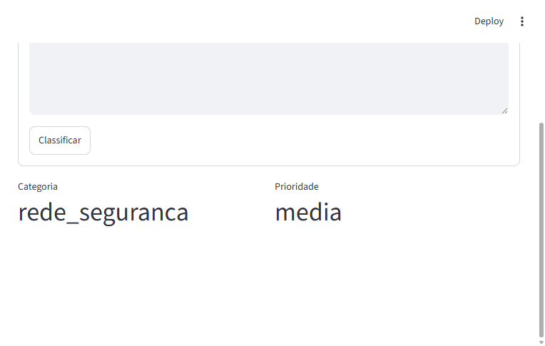

# Automatic IT Ticket Triage

## Summary
This repository organizes an academic and professional Machine Learning prototype for automatic IT ticket triage in Brazilian Portuguese. The application combines a `Scikit-Learn` pipeline trained on synthetic tickets with a `Streamlit` interface for simultaneous category and priority classification.

## Problem addressed
Support desks often receive short, noisy, and heterogeneous incident and request descriptions. This project aims to reduce initial routing time by proposing automatic classification based on technical ITSM keywords, without relying on full sentences or long narrative context.

## Application architecture
The main flow is composed of:

- text input in `app.py`;
- loading of the `pipeline_itsm.joblib` artifact with `@st.cache_resource`;
- vectorization with unigram `TfidfVectorizer`;
- manual removal of Portuguese stop words;
- multioutput classification with `MultiOutputClassifier(RandomForestClassifier)`;
- simultaneous return of `category` and `priority`.

The architecture diagram is available at `assets/diagrams/architecture.mmd`.

## Classification flow
1. The user submits short incident keywords such as `vpn falha mfa dns`.
2. The text is normalized and transformed into a TF-IDF vector.
3. The multioutput classifier estimates the operational category and ticket priority.
4. The interface immediately displays the result to support initial routing.

## Input and output types
Input:

- short free text with ITSM jargon;
- examples: `reset senha ad`, `tela azul memoria`, `outlook erro smtp`.

Output:

- `categoria`: predicted functional class;
- `prioridade`: predicted initial handling level.

## Local installation
```bash
python -m venv .venv
.venv\Scripts\activate
pip install -r requirements.txt
python train.py
streamlit run app.py
```

## Streamlit Cloud deployment
1. Publish the repository to GitHub.
2. Configure the Streamlit Cloud app to point to `app.py`.
3. Ensure `requirements.txt` is present at the repository root.
4. Optionally define variables from `.env.example` only for demo environments.
5. Redeploy whenever the pipeline or dependencies change.

## Training methodology
Training uses a synthetic dataset with technical support and IT operations jargon. The `train.py` file explicitly separates text from labels, preventing data leakage between features and targets.

### Textual representation
The textual module was designed to prioritize lexical robustness:

- lowercase normalization;
- accent stripping;
- `TfidfVectorizer` with unigrams only;
- a manual list of Portuguese stop words focused on connectives and low-information terms.

This setup favors short technical keywords and reduces classification bias based on long formulations or overly specific full sentences.

### Model
The classifier uses `MultiOutputClassifier` with `RandomForestClassifier`, enabling joint inference of category and priority within a single pipeline.

## Results
The demonstration interface below records a classification executed locally by the Streamlit application.



## Model limitations

- the training base is synthetic and does not replace curated real tickets;
- there is no formal train-validation-test statistical evaluation in the current project state;
- the model does not incorporate temporal context, user history, or relations between incidents;
- behavior strongly depends on vocabulary coverage in the synthetic training base.

## Ethical risks in support environments

- incorrect classifications may induce inadequate routing and increase response time;
- synthetic vocabularies may reflect curator bias and under-represent teams or services;
- automatic predictions should not replace human analysis in critical scenarios;
- logs, examples, and screenshots must remain sanitized to avoid operational exposure.

## Next steps

- add quantitative evaluation with per-class metrics;
- introduce automated regression tests for the pipeline;
- incorporate external configuration for classes and priorities;
- add an inference API for ITSM platform integration;
- evaluate linear models and lightweight embeddings for comparison.

## BibTeX references
```bibtex
@misc{python,
  author       = {{Python Software Foundation}},
  title        = {Python Language Reference},
  year         = {2026},
  howpublished = {\url{https://www.python.org/}},
  note         = {Accessed 2026-06-07}
}

@misc{numpy,
  author       = {{NumPy Developers}},
  title        = {NumPy},
  year         = {2026},
  howpublished = {\url{https://numpy.org/}},
  note         = {Accessed 2026-06-07}
}

@misc{joblib,
  author       = {{joblib developers}},
  title        = {joblib: Python utilities for lightweight pipelining},
  year         = {2026},
  howpublished = {\url{https://joblib.readthedocs.io/}},
  note         = {Accessed 2026-06-07}
}

@misc{scikit-learn,
  author       = {{Scikit-learn developers}},
  title        = {Scikit-learn: Machine Learning in Python},
  year         = {2026},
  howpublished = {\url{https://scikit-learn.org/}},
  note         = {Accessed 2026-06-07}
}

@misc{streamlit,
  author       = {{Streamlit Inc.}},
  title        = {Streamlit: The fastest way to build and share data apps},
  year         = {2026},
  howpublished = {\url{https://streamlit.io/}},
  note         = {Accessed 2026-06-07}
}
```
